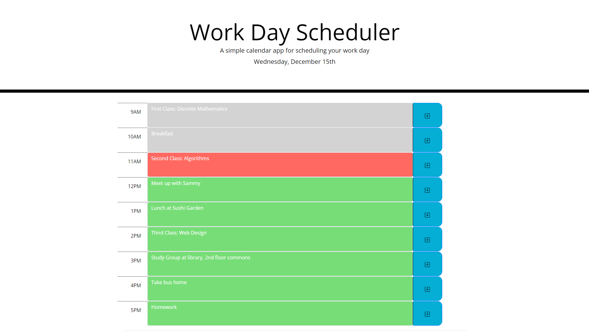

# Homework5

05 Third-Party APIs: Work Day Scheduler

David Schepis

This webpage allows a user to save and schedule events with corresponding event details. It utilizes bootstrap, google font, font awesome,
along with jquery and moment.js. The events are saved in local storage and persist after a refresh. 

Links:

https://github.com/davidschepis/Work_Day_Scheduler

https://davidschepis.github.io/Work_Day_Scheduler/

Screenshot 1 (after 5PM so everything shows green)

Screenshot2 (at 11AM to show color changes)

