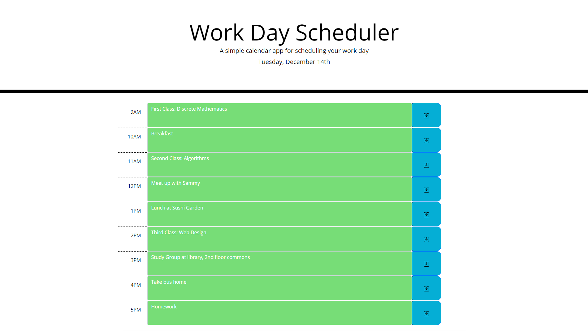

# Homework5

05 Third-Party APIs: Work Day Scheduler

David Schepis

This webpage allows a user to save and schedule events with corresponding event details. It utilizes bootstrap, google font, font awesome,
along with jquery and moment.js.

Links:
https://github.com/davidschepis/Homework5

https://davidschepis.github.io/Homework5/

